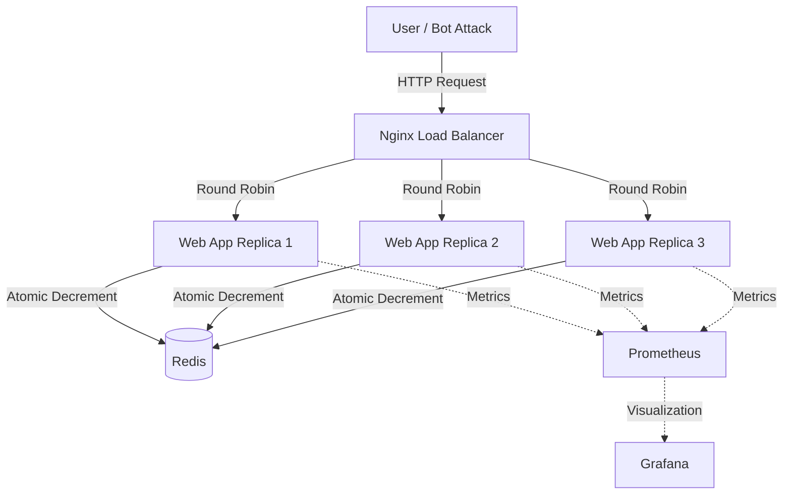

# 🚀 iPhone 17 Pro Max Launch — Flash Sale Microservices System


> **SIMULASI ARSITEKTUR CLOUD UNTUK EVENT FLASH SALE HIGH-CONCURRENCY BERBASIS MICROSERVICES DAN DOCKER ORCHESTRATION**

Proyek ini merupakan simulasi sistem **Flash Sale** untuk peluncuran **iPhone 17 Pro Max (2025)**.  
Sistem dibangun menggunakan arsitektur **Microservices** untuk menangani **traffic ekstrem** dengan karakteristik:

- ⚡ High concurrency  
- ❌ Zero downtime  
- 🛡️ Zero overselling (anti stok minus)

---

## 🌟 Key Features

| Fitur | Deskripsi | Teknologi |
|------|----------|-----------|
| 🛡️ **Race Condition Proof** | Menjamin stok tetap akurat meskipun 1000+ request/detik | Redis Atomic Operation |
| ⚖️ **Load Balancing** | Distribusi beban otomatis ke beberapa replika server | Nginx (Round Robin) |
| ❤️ **Reliable Infrastructure** | Pemulihan cepat berdasarkan kondisi ideal (*Desired State*) | Docker Compose |
| 👁️ **Observability** | Monitoring trafik sukses vs gagal secara real-time | Prometheus & Grafana |
| 💎 **Modern UI** | Tampilan frontend bertema *Apple Event* | HTML5 & CSS3 |

---

## 🏗️ System Architecture

Seluruh sistem berjalan dalam lingkungan **containerized microservices** dengan alur sebagai berikut:



---

## 📂 Struktur Folder

```text
DONPABLO/
├── docker-compose.yml      # Orkestrator Utama (Jantung Sistem)
├── prometheus.yml          # Konfigurasi Monitoring
├── bot_attack.py           # Script Stress Test (Simulasi Serangan)
├── nginx/
│   └── nginx.conf          # Konfigurasi Load Balancer
└── app/
    ├── Dockerfile          # Resep Image Aplikasi
    ├── requirements.txt    # Dependensi Python
    ├── app.py              # Backend Logic
    ├── static/
    │   └── ip17a.jpg       # Aset Gambar
    │   └── ip17b.jpg
    │   └── ip17c.jpg
    │   └── ip17d.jpg
    └── templates/
        └── index.html      # Frontend UI
```

---

## ⚡ Panduan Instalasi (Quick Start)

### Prasyarat

- [Docker Desktop](https://www.docker.com/products/docker-desktop) (Running)
- Python 3.x *(Opsional, untuk script bot)*

---

### 1️⃣ Clone & Build

```bash
git clone https://github.com/Alieff19/DonPablo_FlashSale_Simulation
```
cd repo-ini
```
docker-compose up -d --build
```
Mematikan Service
```
docker compose down
```

---

### 2️⃣ Akses Aplikasi

Buka browser favorit Anda dan kunjungi:  
👉 **http://localhost**

---

## 🧪 Skenario Pengujian

Berikut adalah 3 skenario pengujian untuk membuktikan sistem memenuhi kriteria **Scalable**, **Reliable**, dan **Secure (Aman)**

---

### 🟢 A. Uji Scalability — Load Balancing Check
*Membuktikan sistem dapat membagi beban trafik ke banyak server secara otomatis.*

1. Buka browser ke http://localhost
2. Klik tombol **BELI SEKARANG** beberapa kali secara manual.
3. Perhatikan teks di bawah tombol:
   Dilayani oleh Node: [ID Container]
4. Buka terminal dan jalankan perintah berikut:
   ```
   docker-compose logs -f web
   ```
   Perintah ini digunakan untuk melihat log aktivitas dari service web secara real-time.
6. Perhatikan output log yang muncul di terminal.

✅ Hasil:
- ID Container terus berubah-ubah (misal: dari ...8367 ke ...7ff7).
- Pada terminal, log menunjukkan request dilayani oleh container web yang berbeda-beda.
- Hal ini membuktikan **Nginx Load Balancer** berhasil mendistribusikan beban ke beberapa replika server (Scalable).

---

### 💥B. Uji Reliability — Fault Tolerance (Desired State)
Membuktikan sistem dapat dipulihkan dengan cepat ke kondisi ideal jika terjadi kegagalan.

1. Cek daftar container yang sedang berjalan:
    ```
    docker ps
    ```
2. Sabotase: Matikan paksa salah satu container aplikasi:
    ```
    docker kill donpablo-web-1
    ```
3. Verifikasi: Website tetap dapat diakses karena trafik otomatis dialihkan ke container lain yang masih hidup.

4. Recovery: Jalankan perintah sinkronisasi:
    ```
    docker-compose up -d
    ```
✅ Hasil: Orkestrator mendeteksi adanya kekurangan replika dan menghidupkan kembali container pengganti dalam hitungan detik. Sistem terbukti Reliable karena mampu kembali ke kondisi ideal (Desired State).

---

### 🛡️ C. Uji Security — Data Integrity (Race Condition Proof)
*Membuktikan sistem aman dari kesalahan data (stok minus) saat terjadi trafik tinggi.*

Simulasi 500 pembeli secara bersamaan menggunakan script bot:

1. Install dependency (jika belum):
   ```
   pip install requests
   ```
2. Jalankan simulasi serangan:
   ```
   python bot_attack.py
   ```
✅ Hasil:
- Log terminal berjalan sangat cepat (High Concurrency)
- Stok barang berhenti tepat di angka 0
- Tidak terjadi stok minus (nilai negatif)
- Sistem terbukti **Aman (Secure)** menjaga integritas data dengan Redis Atomic Lock

---

## 📊 Setup Monitoring (Grafana Dashboard)

1. Akses **http://localhost:3000**  
   Login: `admin / admin`
2. Add Data Source → **Prometheus**
3. URL:
```text
http://prometheus:9090
```

4. Buat Dashboard → Add Visualization  
5. Gunakan query berikut:

```promql
sum(rate(flash_sale_requests_total[1m])) by (status)
```

📈 Jalankan stress test dan lihat lonjakan trafik secara real-time

---

## 👨‍💻 Author

| Nama | NIM | Peran |
|------|-----|------|
| **M Alief Alfaridzi** | 1203230045 | Cloud Architect & Backend |
| **Rafif Muhammad** | 1203230018 | Frontend & Documentation |

**Informatika — Universitas Telkom Surabaya**  
*Tugas Besar Mata Kuliah Komputasi Awan & Terdistribusi (2025/2026)*

---

Made with ❤️ and ☕ using **Docker**
